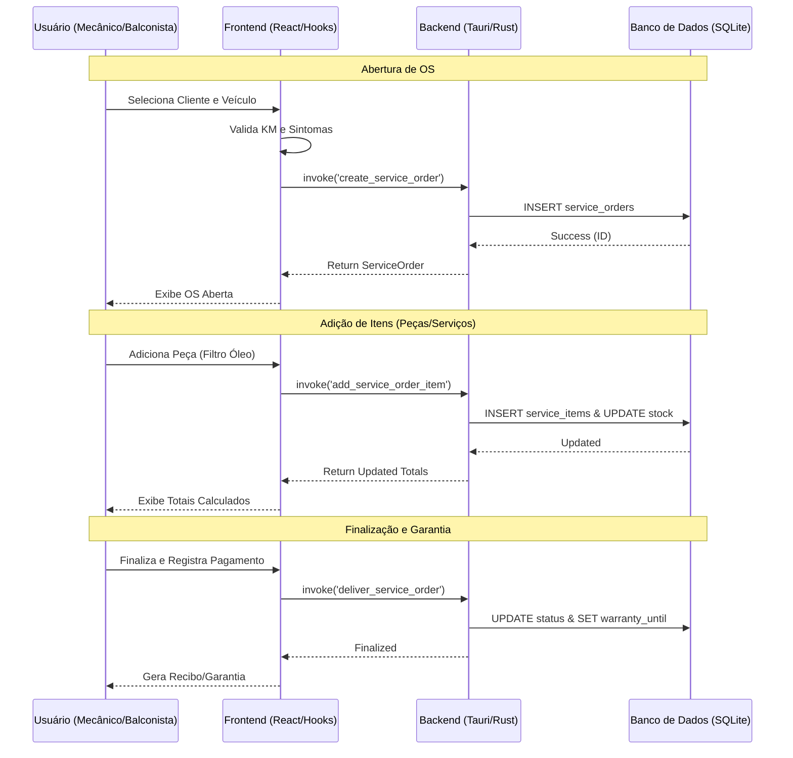

# Auditoria: Módulo Motopeças e Integração de Sistemas

Esta auditoria detalha o estado atual da implementação do módulo de motopeças, identificando o que já foi construído, como os sistemas se integram e os pontos de atenção para as próximas fases.

## 📊 Resumo do Status

| Camada                   | Status  | Observações                                                                        |
| :----------------------- | :------ | :--------------------------------------------------------------------------------- |
| **Banco de Dados**       | ✅ 90%  | Tabelas core (veículos, OS, garantias) implementadas. Faltam seeds FIPE.           |
| **Backend (Rust/Tauri)** | ✅ 85%  | Comandos CRUD e workflow de OS mapeados. Faltam transações multi-step.             |
| **Hooks (Integração)**   | ✅ 100% | `useServiceOrders`, `useVehicles`, `useWarranties` e `useCustomers` completos.     |
| **Frontend (UI)**        | ✅ 95%  | Componentes de gestão prontos. `ServiceOrderForm` operacional. Faltam atalhos PDV. |
| **Hardware**             | ❌ 0%   | Integração com impressora térmica pendente.                                        |

---

## 🔄 Fluxo de Integração e Workflow

O diagrama abaixo ilustra como o GIRO processa uma Ordem de Serviço desde a entrada do veículo até a entrega.

---

## 🔍 Detalhamento Técnico por Componente

### 1. Sistema de Veículos (`useVehicles`)

A integração com veículos segue a hierarquia FIPE:

- **Fluxo:** `get_vehicle_brands` → `get_vehicle_models(brandId)` → `get_vehicle_years(modelId)`.
- **Compatibilidade:** O sistema permite vincular um `productId` a múltiplos `vehicleYearId` através da tabela `ProductCompatibility`.

### 2. Ordens de Serviço (`useServiceOrders`)

- **Gestão de Estado:** `OPEN` → `IN_PROGRESS` → `COMPLETED` → `DELIVERED`.
- **Cálculos:** O backend é responsável por recalcular `labor_cost`, `parts_cost` e `total` a cada item adicionado ou removido, garantindo integridade.

### 3. Garantias (`useWarranties`)

- **Rastreabilidade:** Cada `WarrantyClaim` é vinculado obrigatoriamente a uma `SALE` ou `SERVICE_ORDER`.
- **Workflow:** Permite análise técnica antes da aprovação/negação da troca ou reembolso.

---

## ⚠️ Pontos de Atenção e Riscos

> [!IMPORTANT] > **Transações Atômicas:** Identificamos que a criação de OS + adição de itens iniciais precisa ser atômica para evitar OS vazias em caso de erro no meio do processo.

> [!WARNING] > **Sincronização FIPE:** A base de veículos local deve ser populada via seed/importação. Sem isso, o `VehicleSelector` não retornará dados em ambientes limpos.

---

## 🎯 Próximos Passos Recomendados

1. **Implementar Impressão Térmica:** Essencial para oficinas entregarem o comprovante de entrada da moto.
2. **Setup de Seeds FIPE:** Criar script Rust ou TS para popular as marcas/modelos mais comuns (Honda, Yamaha) para o "Primeiro Contato" do usuário.
3. **Refinar Cadastro de Produtos:** Adicionar visualização rápida de compatibilidade na lista principal de estoque.
4. **Testes de Integração:** Validar o cálculo de impostos e descontos compostos em OS com muitos itens.
