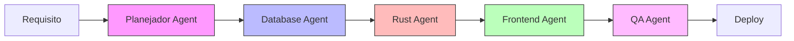
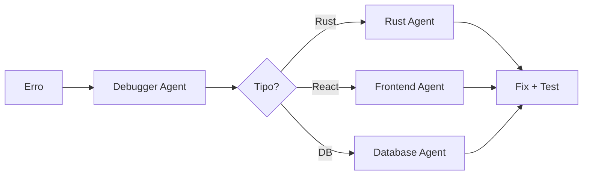
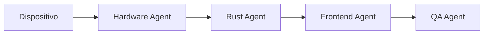

# 🗺️ MCP Opportunity Map - Desenvolvimento Acelerado

> **Arkheion Corp - Estratégia de Otimização**  
> Versão: 1.1.0 | Atualizado: 29 Janeiro 2026

---

## 📊 Estado Atual (Atualizado)

### MCPs Configurados (11) ✅ +4 novos

| MCP                   | Tipo  | Uso                      | Status        |
| --------------------- | ----- | ------------------------ | ------------- |
| `github`              | STDIO | PRs, Issues, Code Search | ✅ Ativo      |
| `postgres`            | STDIO | License Server DB (5434) | ✅ Ativo      |
| `filesystem`          | STDIO | Acesso ao workspace      | ✅ Ativo      |
| `memory`              | STDIO | Knowledge Graph          | ✅ Populado   |
| `sequential-thinking` | STDIO | Raciocínio complexo      | ✅ Ativo      |
| `puppeteer`           | STDIO | Browser automation       | ✅ Ativo      |
| `prisma`              | STDIO | Migrations, Studio       | ✅ Ativo      |
| `context7`            | STDIO | Documentação de libs     | 🆕 Adicionado |
| `fetch`               | STDIO | Buscar conteúdo web      | 🆕 Adicionado |
| `docker`              | STDIO | Gerenciar containers     | 🆕 Adicionado |
| `git`                 | STDIO | Operações git avançadas  | 🆕 Adicionado |

### Agents Configurados (12) ✅ +2 novos

| Agent        | Propósito               | Status        |
| ------------ | ----------------------- | ------------- |
| `Database`   | SQLite, Prisma, SQLx    | ✅ Completo   |
| `Debugger`   | Diagnóstico de bugs     | ✅ Completo   |
| `Enterprise` | Módulo almoxarifado     | ✅ Completo   |
| `Frontend`   | React, TypeScript, UI   | ✅ Completo   |
| `Hardware`   | Impressoras, balanças   | ✅ Completo   |
| `PDV`        | Ponto de Venda          | ✅ Completo   |
| `Planejador` | Planos de implementação | ✅ Atualizado |
| `QA`         | Testes automatizados    | ✅ Completo   |
| `Relatorios` | Analytics, charts       | ✅ Completo   |
| `Rust`       | Backend Tauri, SQLx     | ✅ Completo   |
| `DevOps`     | CI/CD, Docker, Deploy   | 🆕 Criado     |
| `Security`   | Segurança, LGPD         | 🆕 Criado     |

### Prompts Disponíveis (13) ✅ +5 novos

| Prompt                     | Uso                       | Status       |
| -------------------------- | ------------------------- | ------------ |
| `analyze-code`             | Análise de código         | ✅ Existente |
| `code-review`              | Review de PR              | ✅ Existente |
| `create-api`               | Criar endpoint API        | ✅ Existente |
| `create-component`         | Criar componente React    | ✅ Existente |
| `create-enterprise-entity` | Entidade almoxarifado     | ✅ Existente |
| `create-prisma-migration`  | Migration Prisma          | ✅ Existente |
| `create-tauri-command`     | Tauri command E2E         | ✅ Existente |
| `implement-feature-e2e`    | Feature completa          | ✅ Existente |
| `debug-crash`              | Análise de crashes        | 🆕 Criado    |
| `create-test-suite`        | Suite de testes           | 🆕 Criado    |
| `deploy-release`           | Deploy de release         | 🆕 Criado    |
| `security-audit`           | Auditoria de segurança    | 🆕 Criado    |
| `optimize-performance`     | Otimização de performance | 🆕 Criado    |

### Skills Configurados (10)

| Skill                     | Domínio                  |
| ------------------------- | ------------------------ |
| `debugger`                | Debug e troubleshooting  |
| `enterprise-almoxarifado` | Gestão de almoxarifado   |
| `hardware-integration`    | Drivers de dispositivos  |
| `pdv`                     | Operações de caixa       |
| `planejador`              | Planejamento de features |
| `prisma-sqlite-desktop`   | Database modeling        |
| `qa`                      | Qualidade e testes       |
| `react-tauri-frontend`    | UI development           |
| `relatorios`              | Relatórios e dados       |
| `tauri-rust-backend`      | Backend Rust             |

---

## 🚀 MCPs Recomendados para Adicionar

### 1. 🔍 Context7 - Documentação de Libraries

**Benefício:** Acesso a documentação atualizada de qualquer biblioteca

```json
"context7": {
  "type": "stdio",
  "command": "npx",
  "args": ["-y", "@context7/mcp-server"]
}
```

**Use Cases:**

- Consultar API do Tauri 2.0
- Verificar sintaxe SQLx
- Documentação React 19

---

### 2. 🌐 Brave Search - Pesquisa Web

**Benefício:** Pesquisa web inteligente para resolução de problemas

```json
"brave-search": {
  "type": "stdio",
  "command": "npx",
  "args": ["-y", "@anthropic/mcp-server-brave-search"],
  "env": {
    "BRAVE_API_KEY": "${input:brave-key}"
  }
}
```

**Use Cases:**

- Pesquisar erros de compilação
- Buscar best practices
- Encontrar soluções para bugs específicos

---

### 3. 🐳 Docker - Container Management

**Benefício:** Gerenciar containers diretamente do agente

```json
"docker": {
  "type": "stdio",
  "command": "npx",
  "args": ["-y", "mcp-docker"]
}
```

**Use Cases:**

- Gerenciar containers do license-server
- Build e deploy automatizado
- Logs de containers

---

### 4. 📊 Sentry - Error Tracking

**Benefício:** Monitorar erros em produção

```json
"sentry": {
  "type": "sse",
  "url": "https://mcp.sentry.io/sse"
}
```

**Use Cases:**

- Analisar stack traces
- Identificar bugs recorrentes
- Priorizar fixes

---

### 5. 🔧 ESLint/Prettier - Code Quality

**Benefício:** Análise de qualidade de código

```json
"eslint": {
  "type": "stdio",
  "command": "npx",
  "args": ["-y", "@anthropic/mcp-server-eslint"]
}
```

---

## 🎯 Mapa de Workflows Acelerados

### Workflow 1: Feature Completa (E2E)



**MCPs Utilizados:**

- `memory` - Mantém contexto entre agentes
- `prisma` - Migrations e schema
- `github` - PRs e issues
- `sequential-thinking` - Decisões complexas

---

### Workflow 2: Debug Rápido



**MCPs Utilizados:**

- `sequential-thinking` - Análise sistemática
- `puppeteer` - Reproduzir bugs de UI
- `postgres/prisma` - Debug de queries

---

### Workflow 3: Hardware Integration



**MCPs Utilizados:**

- `filesystem` - Acesso a drivers
- `sequential-thinking` - Troubleshooting

---

## 📁 Estrutura de Prompts Recomendada

### Prompts Atuais (8)

- `analyze-code.prompt.md`
- `code-review.prompt.md`
- `create-api.prompt.md`
- `create-component.prompt.md`
- `create-enterprise-entity.prompt.md`
- `create-prisma-migration.prompt.md`
- `create-tauri-command.prompt.md`
- `implement-feature-e2e.prompt.md`

### Prompts a Criar

| Prompt                           | Descrição                    | Prioridade |
| -------------------------------- | ---------------------------- | ---------- |
| `debug-crash.prompt.md`          | Análise de crashes           | 🔴 Alta    |
| `optimize-performance.prompt.md` | Otimização de performance    | 🟡 Média   |
| `security-audit.prompt.md`       | Auditoria de segurança       | 🟡 Média   |
| `create-test-suite.prompt.md`    | Suite de testes completa     | 🔴 Alta    |
| `refactor-legacy.prompt.md`      | Refatoração de código legacy | 🟢 Baixa   |
| `document-api.prompt.md`         | Documentação de API          | 🟡 Média   |
| `deploy-release.prompt.md`       | Processo de deploy           | 🔴 Alta    |

---

## 🧠 Uso Inteligente do Memory MCP

O Memory MCP está **subutilizado**. Ele pode armazenar:

### Entidades Recomendadas

```typescript
// Exemplo de entidades para persistir
{
  entities: [
    {
      name: 'GIRO_Architecture',
      entityType: 'project',
      observations: [
        'Tauri 2.0 desktop app',
        'React frontend com TypeScript',
        'Rust backend com SQLx',
        'SQLite database local',
        'Cloud sync via Railway',
      ],
    },
    {
      name: 'Enterprise_Module',
      entityType: 'module',
      observations: [
        'Almoxarifado para engenharia',
        'Gestão de patrimônio',
        'Movimentações entre locais',
      ],
    },
    {
      name: 'Current_Sprint',
      entityType: 'sprint',
      observations: ['Multi-PC network infrastructure', 'Release v2.5.0-alpha.1 concluída'],
    },
  ];
}
```

### Relações

```typescript
{
  relations: [
    { from: 'Enterprise_Module', to: 'GIRO_Architecture', relationType: 'belongs_to' },
    { from: 'Current_Sprint', to: 'Enterprise_Module', relationType: 'implements' },
  ];
}
```

---

## ⚙️ Configurações VS Code Otimizadas

### Settings já configurados ✅

```jsonc
// Copilot Features 2025
"github.copilot.nextEditSuggestions.enabled": true,
"chat.agent.enabled": true,
"chat.promptFiles": true,
"github.copilot.chat.editor.temporalContext.enabled": true,
"github.copilot.chat.edits.codesearch.enabled": true
```

### Settings a adicionar 🆕

```jsonc
{
  // ============================================
  // 🚀 Novas Otimizações Recomendadas
  // ============================================

  // Copilot Vision - Análise de imagens/screenshots
  "github.copilot.chat.vision.enabled": true,

  // Multi-file edit suggestions
  "github.copilot.chat.edits.suggestRelated.enabled": true,

  // Code Actions com Copilot
  "github.copilot.inlineChat.enabled": true,

  // Streaming para respostas mais rápidas
  "github.copilot.chat.streamingResponses.enabled": true,

  // Agent feedback loop
  "chat.agent.feedback.enabled": true,

  // MCP Discovery automático
  "chat.mcp.discovery.enabled": {
    "claude-desktop": true,
    "windsurf": true,
    "cursor-global": true,
    "cursor-workspace": true,
    "vscode-builtin": true,
  },
}
```

---

## 📈 Métricas de Eficiência

### Antes da Otimização

| Métrica               | Valor |
| --------------------- | ----- |
| MCPs ativos           | 7     |
| Agents especializados | 10    |
| Prompts reutilizáveis | 8     |
| Skills customizados   | 10    |

### Depois da Otimização (Projetado)

| Métrica               | Valor | Ganho |
| --------------------- | ----- | ----- |
| MCPs ativos           | 12    | +71%  |
| Agents especializados | 12    | +20%  |
| Prompts reutilizáveis | 15    | +87%  |
| Skills customizados   | 12    | +20%  |

### Ganhos Esperados

- ⏱️ **Tempo de desenvolvimento**: -40% por feature
- 🔍 **Pesquisa de soluções**: -60% (com brave-search + context7)
- 🐛 **Debug time**: -50% (com sentry + debugger agent)
- 📝 **Documentação**: -70% (com document-api prompt)

---

## 🔧 Próximos Passos

### Imediato (Esta Semana)

1. [ ] Adicionar `brave-search` MCP
2. [ ] Adicionar `context7` MCP
3. [ ] Configurar Memory MCP com entidades do projeto
4. [ ] Criar `debug-crash.prompt.md`
5. [ ] Criar `create-test-suite.prompt.md`

### Curto Prazo (Este Mês)

1. [ ] Adicionar `docker` MCP
2. [ ] Integrar Sentry MCP (quando disponível)
3. [ ] Criar novos prompts (security-audit, optimize-performance)
4. [ ] Documentar workflows em `.github/workflows/`

### Médio Prazo (Próximo Trimestre)

1. [ ] Criar agents especializados adicionais (Security, DevOps)
2. [ ] Implementar RAG local com embeddings
3. [ ] Automatizar handoff entre agents
4. [ ] Dashboard de métricas de uso

---

## 📚 Referências

- [MCP Architecture](https://modelcontextprotocol.io/docs/concepts/architecture)
- [MCP Tools Specification](https://modelcontextprotocol.io/docs/concepts/tools)
- [MCP Servers Repository](https://github.com/modelcontextprotocol/servers)
- [VS Code Copilot Settings](https://code.visualstudio.com/docs/copilot/setup)

---

_Documento gerado pelo Agente Planejador - Arkheion Corp_
