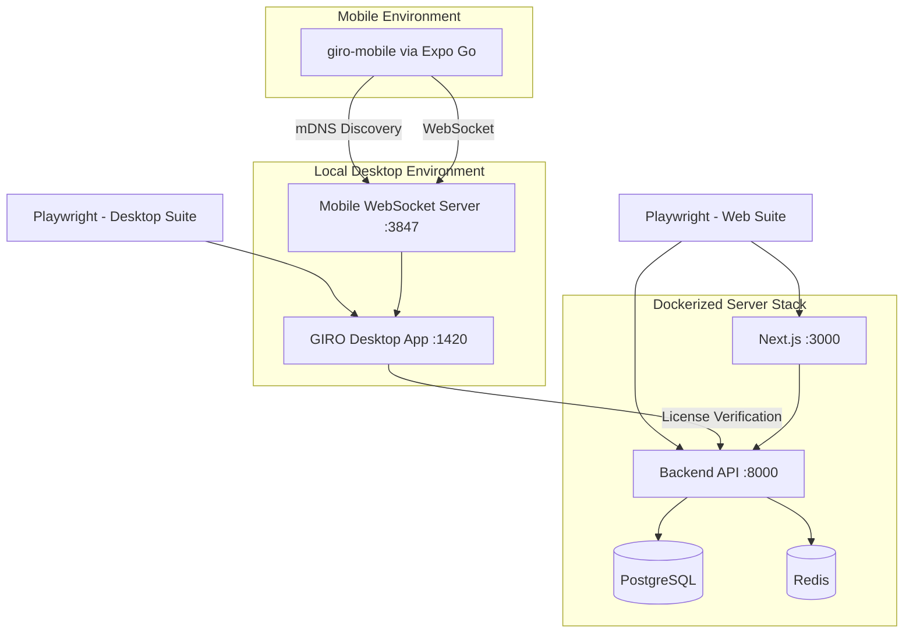
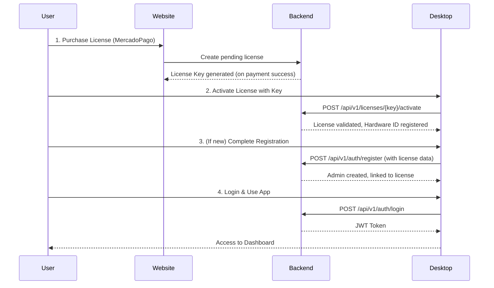

# E2E Testing Infrastructure

This document describes the end-to-end testing strategy for the GIRO ecosystem, covering the Desktop Application, License Server (Backend), and Website (Frontend).

## Architecture Overview



---

## 1. Website & API E2E (`giro-license-server/e2e`)

This suite tests the website frontend and its integration with the backend API using Docker.

### Directory Structure

| File/Folder               | Purpose                                                            |
| ------------------------- | ------------------------------------------------------------------ |
| `docker-compose.e2e.yml`  | Orchestrates the full testing stack (DB, Redis, Backend, Website). |
| `Dockerfile.backend`      | Builds the Rust backend image for E2E.                             |
| `Dockerfile.website`      | Builds the Next.js website image for E2E.                          |
| `playwright.config.ts`    | Playwright configuration (base URL: `http://localhost:3001`).      |
| `tests/auth.spec.ts`      | User registration and login flow tests.                            |
| `tests/dashboard.spec.ts` | Dashboard data display and navigation tests.                       |
| `tests/license.spec.ts`   | License management and verification tests.                         |
| `fixtures/seed.sql`       | SQL file to seed the database with test data.                      |

### Running Tests

```bash
# From repository root
cd giro-license-server

# 1. Build and start the environment
docker compose -f e2e/docker-compose.e2e.yml up -d --build

# 2. Wait for containers to be healthy
docker compose -f e2e/docker-compose.e2e.yml ps

# 3. Execute Playwright tests
cd e2e && npx playwright test

# 4. View reports
npx playwright show-report
```

---

## 2. Desktop Application E2E (`GIRO/apps/desktop`)

This suite tests the Tauri-based desktop application using Playwright.

### Directory Structure

| File/Folder                    | Purpose                                                       |
| ------------------------------ | ------------------------------------------------------------- |
| `playwright.config.ts`         | Playwright configuration (base URL: `http://127.0.0.1:1420`). |
| `tests/e2e/`                   | E2E test specifications.                                      |
| `tests/e2e/global-setup.ts`    | Handles authentication state setup before tests.              |
| `tests/e2e/.auth-storage.json` | Stored authentication state.                                  |

### Running Tests

```bash
# From repository root
cd GIRO/apps/desktop

# 1. Install dependencies (if not already)
pnpm install

# 2. Run E2E tests (starts dev server automatically)
pnpm test:e2e

# 3. Debug E2E tests with UI
pnpm test:e2e:ui
```

---

## 3. Mobile Application Tests (`giro-mobile`)

This suite tests the React Native mobile application for employees.

### Directory Structure

| File/Folder                  | Purpose                                               |
| ---------------------------- | ----------------------------------------------------- |
| `jest.config.js`             | Jest configuration with React Native preset.          |
| `jest.setup.js`              | Global mocks for native modules.                      |
| `app/__tests__/stores/`      | Unit tests for Zustand stores (100% coverage).        |
| `app/__tests__/integration/` | Integration tests for features (connection, scanner). |
| `app/__tests__/components/`  | UI component tests.                                   |

### Running Tests

```bash
# From giro-mobile directory
cd giro-mobile

# Run all tests
pnpm test

# Run with coverage
pnpm test:coverage

# Run specific test file
pnpm test -- --testPathPattern="connectionStore"
```

### Test Status (as of January 2026)

| Category    | Tests | Passing | Status    |
| ----------- | ----- | ------- | --------- |
| Stores      | 65    | 65      | ✅ 100%   |
| Integration | 40    | 32      | 🟡 80%    |
| Components  | 20    | 20      | ✅ 100%   |
| **Total**   | 125   | 117     | **93.6%** |

### Manual Testing with Expo Go

```bash
# Start development server
pnpm start

# Scan QR code with Expo Go app on Android/iOS
# Ensure device is on same WiFi network as Desktop
```

---

## 4. Full Ecosystem Test Flow

To ensure a complete, integrated test of the GIRO ecosystem, the following flow should be verified:



### Key Verification Points

| Step               | Test Location                                    | Assertion                                           |
| ------------------ | ------------------------------------------------ | --------------------------------------------------- |
| License Purchase   | `giro-license-server/e2e/tests/license.spec.ts`  | License key is returned after webhook.              |
| License Activation | `GIRO/apps/desktop/tests/e2e/activation.spec.ts` | Backend returns valid license data via `/activate`. |
| Registration       | `giro-license-server/e2e/tests/auth.spec.ts`     | User is created and can log in.                     |
| Login/Dashboard    | `GIRO/apps/desktop/tests/e2e/dashboard.spec.ts`  | User can access dashboard with valid token.         |

---

## 5. Debugging Failures

### Website E2E

- **Reports:** `giro-license-server/e2e/playwright-report`
- **Artifacts (screenshots, videos):** `giro-license-server/e2e/test-results`

### Desktop E2E

- **Reports:** `GIRO/apps/desktop/playwright-report`
- **Artifacts (screenshots, videos):** `GIRO/apps/desktop/test-results`

### Backend Logs

```bash
docker logs giro-e2e-backend --tail 100
```
