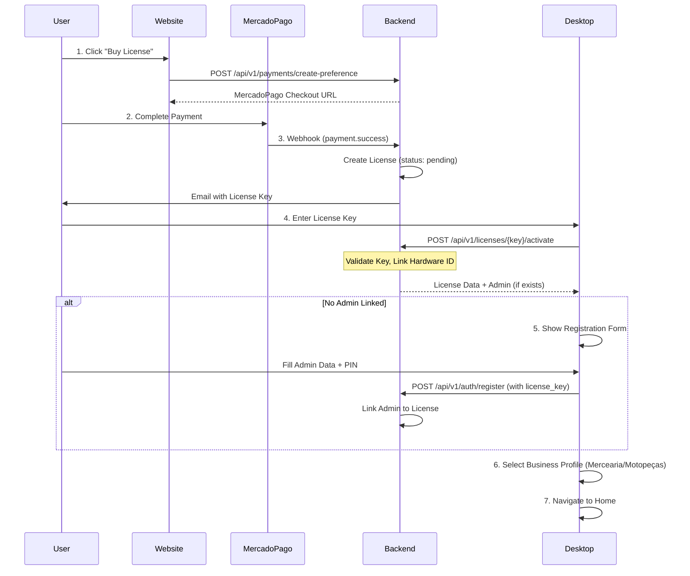
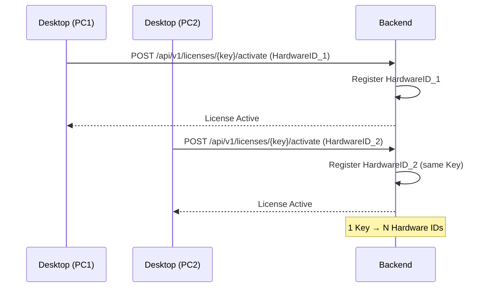
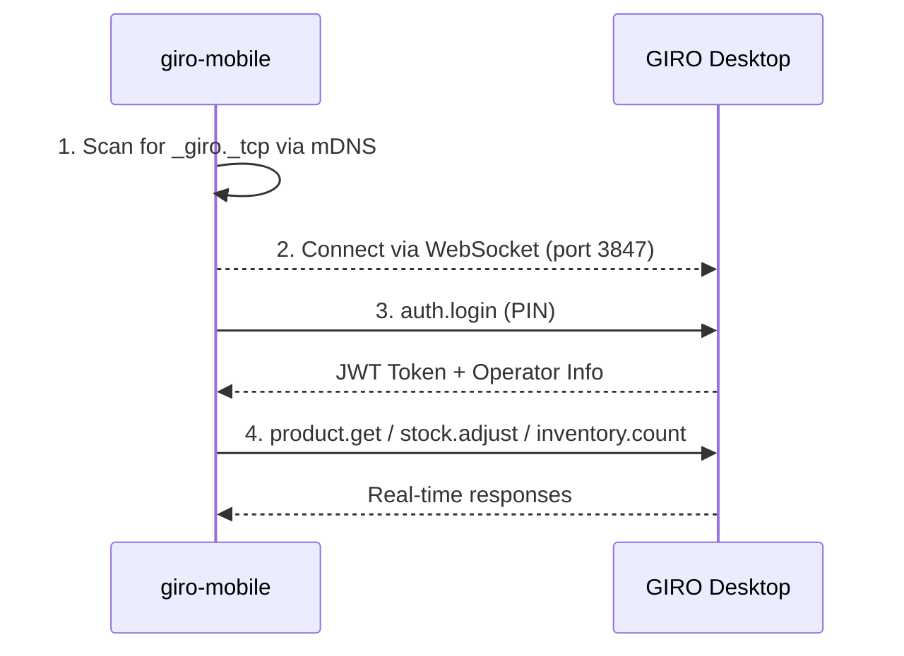

# GIRO Ecosystem Complete Flow

This document describes the complete data flow between the Website, License Server, and Desktop Application.

## System Components

| Component                       | Purpose                                            | Stack                      |
| ------------------------------- | -------------------------------------------------- | -------------------------- |
| **giro-website**                | Marketing site, Login/Register, Payment, Dashboard | Next.js 16                 |
| **giro-license-server/backend** | API, License Management, User Auth, DB Sync        | Rust + Axum                |
| **GIRO Desktop**                | POS, Inventory, Reports, Local DB                  | Tauri 2 + React + SQLite   |
| **giro-mobile**                 | Employee mobile app (Scanner, Stock, Inventory)    | Expo SDK 52 + React Native |

---

## 1. License Purchase & Activation Flow

---

## 2. Multi-Computer / Hardware Registration

Each license can be linked to multiple hardware devices.

---

## 3. Database Synchronization Strategy

### Architecture

- **Local DB:** Each Desktop has a local SQLite database for fast, offline-capable operations.
- **Central DB:** The License Server (PostgreSQL on Railway) stores license, admin, and backup data.

### Sync Mechanism (Implemented)

| Data Type          | Direction        | Trigger                      |
| ------------------ | ---------------- | ---------------------------- |
| Admin/User         | Desktop → Server | On Registration              |
| License Status     | Server → Desktop | On Activation / Startup      |
| Hardware IDs       | Desktop → Server | On Activation                |
| Sales/Stock Backup | Desktop → Server | Manual / End of Day (Future) |

---

## 4. API Endpoints (Key Routes)

### Authentication

| Method | Path                    | Purpose                  |
| ------ | ----------------------- | ------------------------ |
| `POST` | `/api/v1/auth/register` | Create new admin         |
| `POST` | `/api/v1/auth/login`    | Login, receive JWT       |
| `GET`  | `/api/v1/auth/me`       | Get current user profile |

### Licenses

| Method | Path                             | Purpose                             |
| ------ | -------------------------------- | ----------------------------------- |
| `POST` | `/api/v1/licenses/:key/activate` | Activate license, register hardware |
| `POST` | `/api/v1/licenses/:key/validate` | Periodic license validation         |
| `GET`  | `/api/v1/licenses`               | List user's licenses                |
| `GET`  | `/api/v1/hardware`               | List registered hardware            |

### Payments

| Method | Path                                 | Purpose                       |
| ------ | ------------------------------------ | ----------------------------- |
| `POST` | `/api/v1/payments/create-preference` | Initiate MercadoPago checkout |
| `POST` | `/api/v1/payments/webhook`           | Receive MercadoPago events    |

---

## 5. Mobile ↔ Desktop Communication (giro-mobile)

The mobile app communicates with the Desktop via local WiFi using WebSocket and mDNS discovery.

### Connection Flow

### WebSocket Protocol (Port 3847)

| Action             | Purpose                             |
| ------------------ | ----------------------------------- |
| `auth.login`       | Authenticate with employee PIN      |
| `auth.logout`      | End session                         |
| `product.get`      | Get product by barcode/ID           |
| `product.search`   | Search products by name             |
| `stock.adjust`     | Adjust stock (entrada/saída)        |
| `stock.list`       | List stock movements                |
| `inventory.start`  | Start inventory counting session    |
| `inventory.count`  | Count items in inventory            |
| `inventory.finish` | Finalize inventory with adjustments |
| `expiration.list`  | List products by expiration date    |

### Mobile Features

| Feature         | Status | Description                              |
| --------------- | ------ | ---------------------------------------- |
| mDNS Discovery  | ✅     | Auto-discovers Desktop on local network  |
| Barcode Scanner | ✅     | Camera + manual input for product lookup |
| Stock Queries   | ✅     | Real-time stock and product information  |
| Inventory Mode  | ✅     | Counting session with local cache        |
| Expiration View | ✅     | Products by expiration date              |
| Offline Support | ✅     | Local cache for offline operations       |

---

## 6. Requirements Checklist

| #   | Requirement                                        | Status         | Notes                                                                                         |
| --- | -------------------------------------------------- | -------------- | --------------------------------------------------------------------------------------------- |
| 1   | Registration after activation (if no admin linked) | ✅ Implemented | `InitialSetupPage` shows after license activation if `hasAdmin` is false.                     |
| 2   | Desktop sends admin data to server                 | ✅ Implemented | `register` API call includes license_key to link admin.                                       |
| 3   | 1 Key → N Hardware                                 | ✅ Implemented | `LicenseService::verify_license` adds hardware to list.                                       |
| 4   | DB Sync Strategy                                   | ✅ Designed    | Cloud backup linked to key. Implementation: Desktop syncs critical data to `/api/v1/backups`. |
